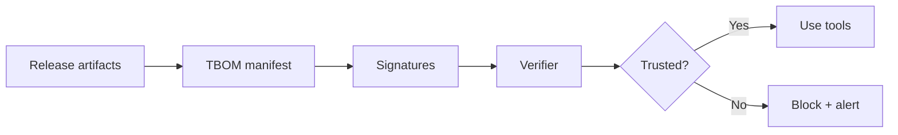
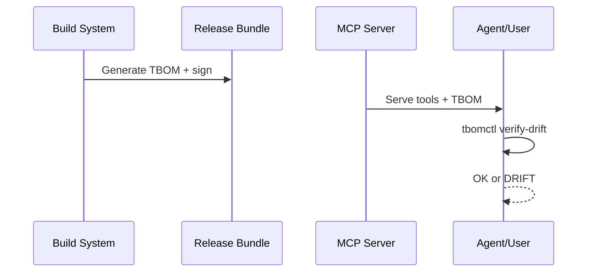

# TBOM Reference Implementation (v1.0.2)


[](https://modelcontextprotocol.io)
[](https://github.com/jlov7/tbom-rfc/actions/workflows/ci.yml)
[](https://github.com/jlov7/tbom-rfc/actions/workflows/release.yml)

[](https://opensource.org/licenses/Apache-2.0)

```
 _______ ____  __  __
|__   __|  _ \|  \/  |
   | |  | |_) | \  / |
   | |  |  _ <| |\/| |
   | |  | |_) | |  | |
   |_|  |____/|_|  |_|
```

**Tool Bill of Materials (TBOM)** is a provenance and integrity standard for the Model Context Protocol (MCP) ecosystem. It provides a cryptographically signed manifest that binds MCP server releases to immutable tool metadata, enabling automated trust verification and preventing tool poisoning in AI agent supply chains.

## For everyone (non-technical TL;DR)

- Think of TBOM as a tamper-evident label for AI tools and MCP servers.
- If a tool changes after release, TBOM verification detects it immediately.
- You can prove what was shipped and what is running, even months later.

## Quick start

```bash
python3 -m venv .venv
source .venv/bin/activate
python -m pip install -r requirements.lock
# For minimal tooling only:
# python -m pip install -r requirements.txt
./build.sh
```

`./build.sh` runs `make all`, which:
- validates JSON examples against the schema,
- verifies the signed test vector,
- runs linting (`ruff`), type checking (`mypy`), and unit tests (`pytest`),
- runs integration tests and AI-style evals.

## Visual Demo

Two-minute walkthrough with visible output:
- `docs/TERMINAL_DEMO.md`

```
TBOM verification pipeline
--------------------------
[tools/list] -> [tbomctl verify-drift] -> [digest compare] -> [OK | DRIFT]

TBOM signing path
-----------------
[tbom.json] -> [tbomctl sign-jws] -> [detached JWS] -> [tbomctl check]
```

```bash
python tbomctl.py check --schema tbom-schema-v1.0.2.json tbom-example-full-v1.0.2.json
# OK
```

## How it works (visuals)





## MCP Server

This repo includes a reference MCP server that demonstrates how to serve a TBOM and provide verification services:

```bash
# Run the TBOM reference server
python tbom_mcp_server.py
```

Note: the MCP server requires the `mcp` Python package (`python -m pip install mcp`).

## Tooling

### tbomctl.py
A reference CLI for managing TBOMs:

```bash
# Canonicalize JSON (RFC 8785)
python tbomctl.py canon <file.json>

# Compute tool definition digest
python tbomctl.py digest-tool <tool.json>

# Validate TBOM against schema and verify digests/signatures
python tbomctl.py check --schema tbom-schema-v1.0.2.json <tbom.json>

# Generate TBOM skeleton
python tbomctl.py generate --subject subject.json --tools-list tools.json --output tbom.json

# Detect drift between TBOM and live server response
python tbomctl.py verify-drift --tbom tbom.json --tools-list live-tools.json
```

## Project Structure
- **Schemas**: `tbom-schema-v1.0.2.json`, `tbom-keys-schema-v1.0.1.json`
- **Reference Tooling**: `tbomctl.py`, `tbom_mcp_server.py`
- **Examples**: `tbom-example-full-v1.0.2.json`, `tbom-example-minimal-v1.0.2.json`
- **Build System**: `Makefile`, `build.sh`, `scripts/generate_provenance.py`
- **Documentation**: `EXECUTIVE_SUMMARY.md`, `FAQ.md`, `RELEASE_NOTES_v1.0.2.md`, `PERFORMANCE.md`, `SECURITY_AUDIT.md`, `SECURITY.md`, `CODE_OF_CONDUCT.md`, `docs/TERMINAL_DEMO.md`

## Repository Map

```
tbomctl.py              CLI tooling
tbom_mcp_server.py      Reference MCP server
tbom-schema-v1.0.2.json TBOM schema
tests/                  Unit + integration tests
scripts/                Build, eval, and mutation tooling
docs/                   Visual demos and walkthroughs
```

## Development

We use `ruff` for linting, `mypy` for types, and `pytest` for tests.

```bash
make lint
make test
make integration-test  # requires the MCP Python package
make verify            # full verification suite
make verify-strict     # adds mutation tests
```

See `TESTING.md` for full verification details.

## Release Bundle

The release bundle in `dist/` includes schemas, tooling, docs, and a signed provenance attestation (`provenance.json`).

Verify the release:
```bash
make verify-release
```
