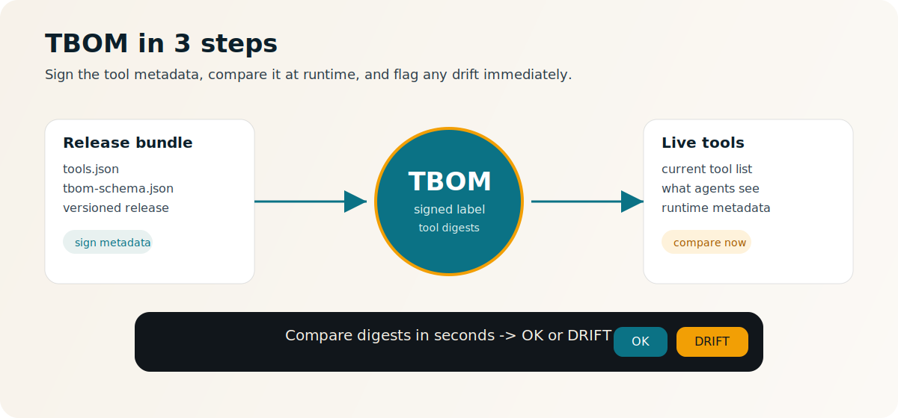
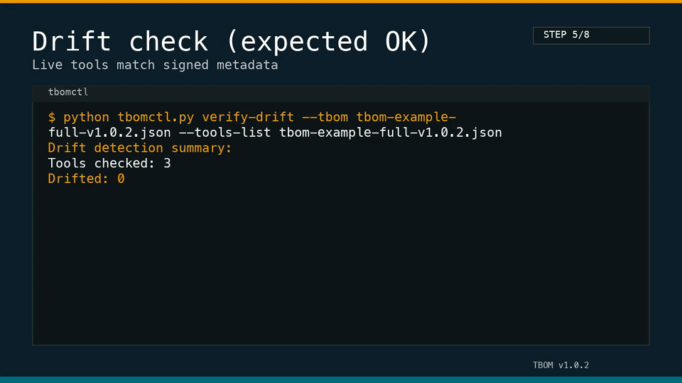
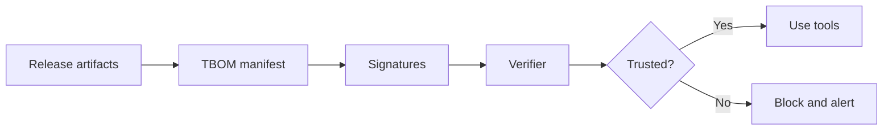
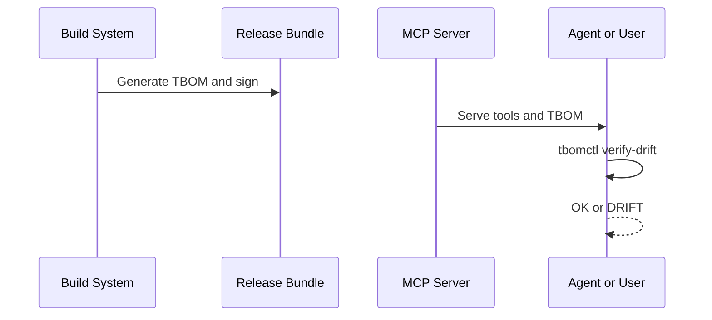

# TBOM Reference Implementation (v1.0.2)


[](https://modelcontextprotocol.io)
[](https://github.com/jlov7/tbom-rfc/actions/workflows/ci.yml)
[](https://github.com/jlov7/tbom-rfc/actions/workflows/release.yml)

[](https://opensource.org/licenses/Apache-2.0)
[](https://doi.org/10.5281/zenodo.18458945)

```
/-----------------------------------\
| TTTTT BBBB  OOO  M   M            |
|   T   B   B O   O MM MM           |
|   T   BBBB  O   O M M M           |
|   T   B   B O   O M   M           |
|   T   BBBB  OOO  M   M            |
\-----------------------------------/
[build] -> [sign] -> [verify] -> [trust]
```

**Tool Bill of Materials (TBOM)** is a provenance and integrity standard for the Model Context Protocol (MCP) ecosystem. It provides a cryptographically signed manifest that binds MCP server releases to immutable tool metadata, enabling automated trust verification and preventing tool poisoning in AI agent supply chains.

## TBOM in 30 seconds (non-technical)

TBOM is a signed label for MCP tools. It answers three questions:
What shipped? What is running? Did anything change?

Simple rule: same label + same metadata => OK. Anything else => DRIFT.

STAMP model:
- **Signed**: provenance is cryptographically verifiable.
- **Tamper-evident**: any text/schema change flips to DRIFT.
- **Auditable**: you can re-check the exact release months later.
- **Machine-checkable**: policy engines can enforce checks without human review.
- **Provenance**: the label anchors tool metadata to a specific release.

Explainer: `docs/explainer.md`.



## Quick start

```bash
python3 -m venv .venv
source .venv/bin/activate
python -m pip install -r requirements.lock
python -m pip install -e .

tbomctl check --schema tbom-schema-v1.0.2.json tbom-example-full-v1.0.2.json
# OK
```

Prefer not to install? Run `python tbomctl.py ...` directly.
Alternative: `make install-cli` (after activating the venv).

To run the full verification suite:

```bash
./build.sh
```

`./build.sh` runs `make all`, which:
- validates JSON examples against the schema,
- verifies the signed test vector,
- runs linting (`ruff`), type checking (`mypy`), and unit tests (`pytest`),
- runs integration tests and AI-style evals.

## Visual Demo

Two-minute walkthrough with visible output:
- `docs/TERMINAL_DEMO.md`
- `DEMO_SCRIPT.md` (60-second live demo script)
Architecture + threat model:
- `ARCHITECTURE.md`

Animated preview from the generated demo:



## Showcase Pack

Generate a narrated demo and evidence pack (logs + metrics):

```bash
make showcase
make demo-video
make demo-video-strict
make demo-video-light
make demo-gif
make demo-gif-light
```

Artifacts land in `build/showcase/`.
Voiceover is generated automatically if `say` (macOS) or `espeak` is available.
Guide: `docs/showcase/index.md`.

```
TBOM verification pipeline
--------------------------
[tools/list] -> [tbomctl verify-drift] -> [digest compare] -> [OK | DRIFT]

TBOM signing path
-----------------
[tbom.json] -> [tbomctl sign-jws] -> [detached JWS] -> [tbomctl check]
```

```bash
python tbomctl.py check --schema tbom-schema-v1.0.2.json tbom-example-full-v1.0.2.json
# OK
```

## How it works (visuals)





## MCP Server

This repo includes a reference MCP server that demonstrates how to serve a TBOM and provide verification services:

```bash
# Run the TBOM reference server
python tbom_mcp_server.py
```

Note: the MCP server requires the `mcp` Python package (`python -m pip install mcp`), which requires Python 3.10+.

## Tooling

### tbomctl.py
A reference CLI for managing TBOMs:

```bash
# Canonicalize JSON (RFC 8785)
python tbomctl.py canon <file.json>

# Compute tool definition digest
python tbomctl.py digest-tool <tool.json>

# Validate TBOM against schema and verify digests/signatures
python tbomctl.py check --schema tbom-schema-v1.0.2.json <tbom.json>

# Generate TBOM skeleton
python tbomctl.py generate --subject subject.json --tools-list tools.json --output tbom.json

# Detect drift between TBOM and live server response
python tbomctl.py verify-drift --tbom tbom.json --tools-list live-tools.json
```

## Project Structure
- **Schemas**: `tbom-schema-v1.0.2.json`, `tbom-keys-schema-v1.0.1.json`
- **Reference Tooling**: `tbomctl.py`, `tbom_mcp_server.py`
- **Examples**: `tbom-example-full-v1.0.2.json`, `tbom-example-minimal-v1.0.2.json`
- **Build System**: `Makefile`, `build.sh`, `scripts/generate_provenance.py`
- **Documentation**: `EXECUTIVE_SUMMARY.md`, `DEMO_SCRIPT.md`, `ARCHITECTURE.md`, `FAQ.md`, `RELEASE_NOTES_v1.0.2.md`, `PERFORMANCE.md`, `SECURITY_AUDIT.md`, `SECURITY.md`, `CODE_OF_CONDUCT.md`, `docs/TERMINAL_DEMO.md`, `docs/showcase/index.md`, `mkdocs.yml`

## Repository Map

```
tbomctl.py              CLI tooling
tbom_mcp_server.py      Reference MCP server
tbom-schema-v1.0.2.json TBOM schema
tests/                  Unit + integration tests
scripts/                Build, eval, and mutation tooling
docs/                   Visual demos and walkthroughs
ARCHITECTURE.md         Architecture + threat model
DEMO_SCRIPT.md          60-second live demo script
mkdocs.yml              Docs site configuration
```

## Development

We use `ruff` for linting, `mypy` for types, and `pytest` for tests.

```bash
make lint
make test
make integration-test  # requires the MCP Python package
make verify            # full verification suite
make verify-strict     # adds mutation tests
```

See `TESTING.md` for full verification details.

Docs site (optional):

```bash
python -m pip install -r docs/requirements.txt
mkdocs serve
```

## Credibility Signals

- CodeQL and OpenSSF Scorecard scans run in CI
- SBOM generated on each release
- Evidence pack generated via `make showcase`

## Release Bundle

The release bundle in `dist/` includes schemas, tooling, docs, and a signed provenance attestation (`provenance.json`).

Verify the release:
```bash
make verify-release
```

<sub>This project is independent research. Views expressed are the author's own and do not represent those of any employer or affiliated organization.</sub>
