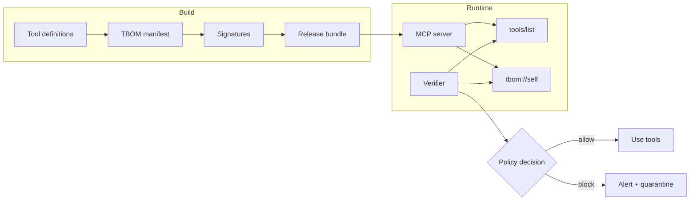
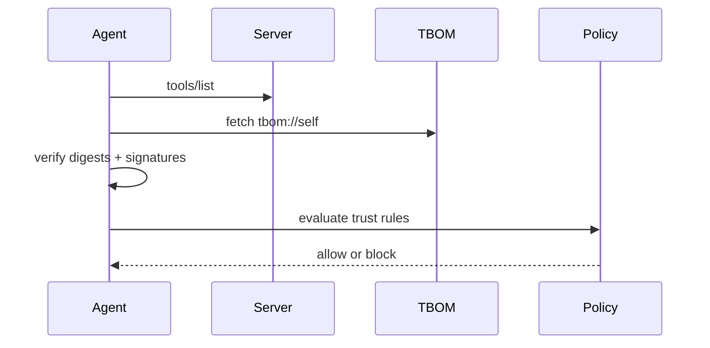
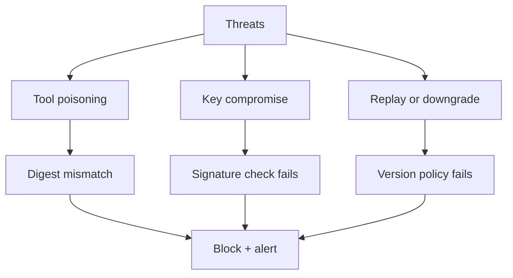

# Architecture

## System overview

TBOM creates a signed, machine-verifiable link between:
- the release bundle, and
- the exact tool metadata that an MCP server exposes at runtime.

## Policy decision sequence

## Threat model (high-level)

| Threat | Signal | Mitigation |
| --- | --- | --- |
| Tool description tampering | Drifted digests | verify-drift blocks use |
| Registry key compromise | Signature mismatch | validate keys + signatures |
| Stale tool list | Missing in live/TBOM | policy denies or escalates |
| Downgrade or replay | Older TBOM version | policy enforces min version |

