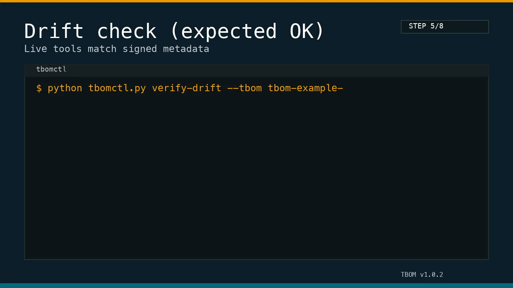

# TBOM explainer (non-technical)

TBOM is a signed label for AI tools. It records what the tool says it will do, signs it, and lets you compare
the live tool metadata against that label in seconds.

It answers three questions:
- What shipped?
- What is running now?
- Did anything change?

## The STAMP model

- **Signed**: you can verify who published the metadata.
- **Tamper-evident**: any change flips the result to DRIFT.
- **Auditable**: you can re-run the check months later and get the same answer.
- **Machine-checkable**: policy engines can block drift automatically.
- **Provenance**: the label is tied to a specific release bundle.

## What changes look like

If a tool description or schema changes, the digest no longer matches.
That is what TBOM calls **DRIFT**.

Rule of thumb:
- Same label + same metadata => OK
- Anything else => DRIFT

## One-line summary

TBOM makes tool metadata provable, not just readable.
