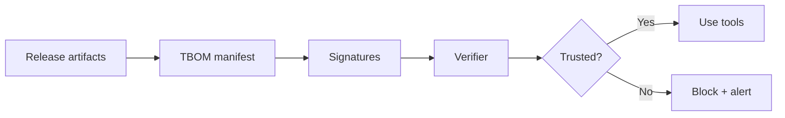

<!-- markdownlint-disable MD033 MD041 -->
<div class="tbom-hero">
  <div class="tbom-hero__grid">
    <div>
      <div class="tbom-hero__tag">Tamper-evident tool metadata</div>
      <h1 class="tbom-hero__title">TBOM</h1>
      <p class="tbom-hero__subtitle">
        Tool Bill of Materials for MCP. Prove what was shipped, detect drift in seconds,
        and keep tool behavior transparent across releases.
      </p>
      <div class="tbom-hero__cta">
        <a class="tbom-button" href="demo/">Run the 60-second demo</a>
        <a class="tbom-button tbom-button--ghost" href="showcase/">Open the showcase pack</a>
      </div>
    </div>
    <div class="tbom-hero__sigil">
      
    </div>
  </div>
</div>

<pre class="tbom-ascii">
  _______ ____  ____  __  __
 |__   __|  _ \|  _ \|  \/  |
    | |  | |_) | |_) | \  / |
    | |  |  _ <|  _ <| |\/| |
    | |  | |_) | |_) | |  | |
    |_|  |____/|____/|_|  |_|
  [build] -> [sign] -> [verify] -> [trust]
</pre>

## Why it matters

TBOM makes tool metadata tamper-evident. If a tool's description or schema changes
after release, the digest check flips from OK to DRIFT.

## What you get

<div class="tbom-grid">
  <div class="tbom-card">
    <h3>Integrity Proof</h3>
    <p>Signed manifests bind tools to releases, proving what shipped.</p>
  </div>
  <div class="tbom-card">
    <h3>Drift Detection</h3>
    <p>Live tool lists are compared to signed digests to catch tampering.</p>
  </div>
  <div class="tbom-card">
    <h3>Evidence Pack</h3>
    <p>Auto-generated logs and metrics for audits and reviews.</p>
  </div>
</div>

## One-glance flow



## Quick proof

```bash
python tbomctl.py check --schema tbom-schema-v1.0.2.json tbom-example-full-v1.0.2.json
python tbomctl.py verify-drift --tbom tbom-example-full-v1.0.2.json --tools-list tbom-example-full-v1.0.2.json
```

## Get the evidence pack

```bash
make showcase
```

Artifacts land in `build/showcase/` with a demo log, metrics, and a zipped evidence pack.
